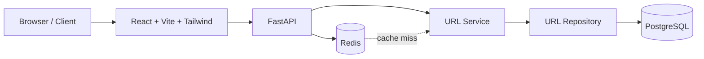

# URL Shortener

A production-oriented URL shortening service built with **FastAPI, PostgreSQL, Redis, and React**. The project demonstrates a clean layered backend architecture, cache-aside redirection, Redis-backed rate limiting, atomic click tracking, database migrations, automated tests, and full Docker-based deployment.

## 🚀 Live Deployment

| Service | URL |
|---|---|
| **Frontend** | https://url-shortener-production-121.up.railway.app |
| **API** | https://api-production-bf7ba.up.railway.app |
| **API Docs** | https://api-production-bf7ba.up.railway.app/docs |
| **OpenAPI** | https://api-production-bf7ba.up.railway.app/api/v1/openapi.json |

> The backend is deployed on Railway with managed PostgreSQL and Redis services.

---

## ✨ Features

- **Short URL generation** with unique 7-character Base62 codes.
- **Custom aliases** such as `/my-project` for human-readable links.
- **Optional expiration** for time-limited URLs.
- **Fast redirects** using Redis cache-aside with PostgreSQL fallback.
- **Click analytics** with atomic PostgreSQL increments.
- **IP-based rate limiting** for URL creation using Redis fixed windows.
- **URL validation** using Pydantic request schemas.
- **REST API** documented automatically with OpenAPI / Swagger UI.
- **React SPA** with responsive URL creation and analytics views.
- **Database migrations** managed with Alembic.
- **Automated backend tests** using pytest and pytest-asyncio.
- **Full Docker Compose setup** for PostgreSQL, Redis, migrations, API, and frontend.
- **Nginx SPA serving** for the production frontend container.

---

## 🏗️ Architecture



### Redirect flow

```text
GET /{short_code}
       ↓
    Redis lookup
       ↓
  ┌────┴────┐
  │         │
 HIT      MISS
  │         │
  ↓         ↓
Redirect  PostgreSQL
            ↓
       Cache result
            ↓
         Redirect
```

### Create URL flow

```text
POST /api/v1/urls
        ↓
   Pydantic validation
        ↓
     URL Service
        ↓
   Generate short code
        ↓
     PostgreSQL
        ↓
    201 Created
```

---

## 🧠 Design Decisions

### PostgreSQL is the source of truth

URL records and click counts are stored in PostgreSQL. Redis is treated as an infrastructure layer for caching and rate limiting rather than as the primary database.

### Cache-Aside pattern

Redirect requests first check Redis. On a cache miss, the service reads from PostgreSQL and then populates Redis. If Redis becomes unavailable, the application falls back to PostgreSQL so redirects can continue to work.

### Atomic click tracking

Click counts are incremented using a database-side atomic update rather than reading a value into application memory and writing it back. This avoids lost updates during concurrent redirects.

### Collision-safe short codes

Random 7-character Base62 codes provide a large namespace. A unique database constraint protects against collisions, and code generation can retry when a collision occurs.

### Fixed-window rate limiting

URL creation is protected with a Redis fixed-window limiter. The current policy allows **10 creation requests per minute per IP**.

---

## 🛠️ Tech Stack

### Backend

- Python
- FastAPI
- Pydantic v2
- SQLAlchemy 2.0 (async)
- asyncpg
- Alembic
- Redis

### Frontend

- React 19
- Vite
- Tailwind CSS v4
- React Router
- Lucide React

### Infrastructure & Testing

- PostgreSQL
- Redis
- Docker
- Docker Compose
- Nginx
- pytest
- pytest-asyncio
- HTTPX

---

## 📁 Project Structure

```text
URL-shortener/
├── app/
│   ├── api/
│   │   └── routes/           # REST API routes
│   ├── core/                 # Configuration, rate limiting, errors
│   ├── db/                   # PostgreSQL and Redis connections
│   ├── models/               # SQLAlchemy models
│   ├── repository/           # Database access layer
│   ├── schemas/              # Pydantic request/response schemas
│   ├── services/             # Business logic
│   └── utils/                # Utility functions such as Base62
├── frontend/
│   ├── src/
│   │   ├── components/       # Reusable UI components
│   │   ├── layouts/          # Application layouts
│   │   ├── pages/            # Home and analytics pages
│   │   ├── services/         # API client
│   │   └── utils/            # Frontend helpers
│   ├── Dockerfile
│   └── nginx.conf
├── migrations/               # Alembic migrations
├── tests/                    # Backend test suite
├── .env.example
├── docker-compose.yml
├── Dockerfile
└── README.md
```

---

## 🔌 API Endpoints

| Method | Endpoint | Purpose |
|---|---|---|
| `POST` | `/api/v1/urls` | Create a shortened URL |
| `GET` | `/{short_code}` | Redirect to the original URL |
| `GET` | `/api/v1/urls/{short_code}/stats` | Get URL statistics |
| `GET` | `/health` | Health check |
| `GET` | `/docs` | Swagger UI |
| `GET` | `/api/v1/openapi.json` | OpenAPI schema |

### Create a URL

```http
POST /api/v1/urls
Content-Type: application/json
```

```json
{
  "target_url": "https://example.com",
  "custom_alias": "my-alias",
  "expires_at": "2026-10-10T12:00:00Z"
}
```

Response:

```json
{
  "id": 1,
  "short_code": "my-alias",
  "target_url": "https://example.com",
  "created_at": "2026-09-10T00:00:00Z",
  "expires_at": null,
  "clicks": 0,
  "is_active": true,
  "short_url": "https://api-production-bf7ba.up.railway.app/my-alias"
}
```

### Redirect

```http
GET /my-alias
```

Returns a `307 Temporary Redirect` to the original target URL and increments the click counter.

### Analytics

```http
GET /api/v1/urls/my-alias/stats
```

Returns the URL lifecycle information and current click count.

---

## ⚙️ Validation & Limits

- Target URL maximum length: **2048 characters**.
- Target URLs are validated for supported HTTP/HTTPS usage.
- Custom aliases are optional and limited to **3–30 characters**.
- Supported custom alias characters: letters, numbers, `_`, and `-`.
- URL creation rate limit: **10 requests/minute/IP**.
- Generated short codes use **7 Base62 characters**.

---

## 🐳 Run Locally with Docker

### Prerequisites

- Docker
- Docker Compose
- Git

### Start the complete stack

```bash
git clone https://github.com/sai-krishna-kotha/URL-shortener.git
cd URL-shortener

cp .env.example .env

docker compose up -d --build
```

The local services are available at:

- Frontend: `http://localhost:3000`
- API: `http://localhost:8000`
- Swagger UI: `http://localhost:8000/docs`

### Stop the stack

```bash
docker compose down
```

To also remove the local PostgreSQL volume:

```bash
docker compose down -v
```

---

## 🔐 Environment Variables

The local `.env.example` contains the following configuration:

```env
# Database
POSTGRES_USER=postgres
POSTGRES_PASSWORD=postgres
POSTGRES_DB=url_shortener
POSTGRES_SERVER=postgres
POSTGRES_PORT=5432

# Redis
REDIS_URL=redis://redis:6379/0

# Application
PROJECT_NAME="URL Shortener API"
API_V1_STR=/api/v1
DOMAIN=http://localhost:8000

# Frontend build-time API URL
VITE_API_BASE_URL=http://localhost:8000
```

For production, use the deployment provider's environment variables and secrets rather than committing credentials to the repository.

---

## 🗃️ Database Migrations

Alembic manages database schema changes.

The Docker Compose stack includes a dedicated migration service that runs:

```bash
alembic upgrade head
```

before the API becomes available.

---

## 🧪 Testing

Backend tests can be executed inside the API container:

```bash
docker compose exec -e PYTHONPATH=/app api pytest tests/
```

The project test suite covers API behavior, repository logic, validation, redirect behavior, rate limiting, and related backend functionality.

---

## 🧰 Example cURL Commands

### Create a short URL

```bash
curl -X POST http://localhost:8000/api/v1/urls \
  -H "Content-Type: application/json" \
  -d '{"target_url":"https://example.com"}'
```

### Follow a short URL

```bash
curl -i http://localhost:8000/<short_code>
```

### Get statistics

```bash
curl http://localhost:8000/api/v1/urls/<short_code>/stats
```

### Health check

```bash
curl http://localhost:8000/health
```

---

## 📊 HTTP Status Codes

| Status | Meaning |
|---|---|
| `201` | URL created successfully |
| `307` | Redirect to the target URL |
| `400` | Invalid URL or alias |
| `404` | Short code not found |
| `409` | Custom alias already exists |
| `410` | URL expired or inactive |
| `422` | Request validation / malformed JSON |
| `429` | Rate limit exceeded |

---

## 🚧 Known Limitations

The current version intentionally keeps the system simple and interview-defensible.

- Analytics are publicly accessible and are not tied to authenticated users.
- The rate limiter uses a fixed-window strategy, so requests near window boundaries can create bursts.
- Click counting is synchronous and ultimately writes to PostgreSQL for every redirect.
- Redis is used for cache/rate limiting, but there is no distributed event pipeline for analytics.
- There is no user authentication, URL ownership model, or dashboard-level authorization yet.

---

## 🔮 Future Improvements

- JWT authentication and per-user URL ownership.
- Private analytics dashboards.
- Asynchronous click-event buffering with a queue/worker model.
- Token-bucket or sliding-window rate limiting.
- Background cleanup for expired URLs.
- Advanced analytics such as referrer, device, country, and time-series data.
- Observability with structured logs, metrics, and tracing.
- CI/CD pipeline with automated tests and deployment checks.

---

## 🎯 Why This Project

This project was designed to demonstrate practical backend engineering concepts rather than only a basic CRUD implementation:

- Layered architecture: **Router → Service → Repository**
- Asynchronous database access
- PostgreSQL as the system of record
- Redis cache-aside design
- Atomic database updates
- Rate limiting
- API validation and error handling
- Database migrations
- Containerization and service orchestration
- Production deployment
- Automated testing

---

## 👨‍💻 Author

**Sai Krishna Kotha**

- GitHub: https://github.com/sai-krishna-kotha
- LinkedIn: https://www.linkedin.com/in/kothasaikrishna/

---

## 📄 License

This project is currently provided as a personal portfolio / learning project.
